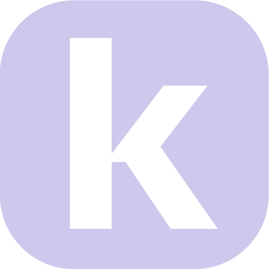

<p align="center">
  
</p>

<h1 align="center">knkt</h1>

<p align="center">
  <em>Don't just grow your skills.</em><br>
  <em>Grow your circle.</em>
</p>

**A Bluetooth-powered, AI-driven mobile platform built by students, for students.** knkt (pronounced "connect") passively scans for nearby peers, computes cosine similarity across skill embeddings and focus areas, and delivers a personalized match summary the moment two students with complementary profiles are in the same vicinity — turning physical proximity into meaningful connections for startups, research, and everything in between.

---

## The Problem

University campuses are full of untapped potential. You might sit next to your ideal co-founder in lecture, work across the hall from someone whose research perfectly complements yours, or grab coffee beside a developer who has exactly the skills your side project needs. But you'd never know it.

Existing platforms like LinkedIn are built for remote, intentional networking. They require you to already know *who* you're looking for. There's nothing that answers the question: **"Who around me right now would I work well with?"**

## Our Solution

knkt bridges this gap with three core ideas:

**Proximity as a signal.** If two students are in the same space, they already share context (same class, same event, same lab). knkt uses Bluetooth to detect these co-located peers passively in the background, with no QR codes, no usernames, no action required.

**AI-driven compatibility.** Rather than showing you everyone nearby, knkt runs a multi-dimensional matching algorithm that scores how well two students *complement* each other: do they have what the other needs? Are they working toward similar goals? Are they in the same domain? Only strong matches surface.

**Frictionless connection.** When a strong match is found, both students receive a push notification with a personalized AI-generated summary explaining *why* they'd work well together. If both accept, a chat room opens instantly.

---

## How It Works

```
                              ┌─────────────────────────────────┐
                              │         STUDENT ONBOARDING      │
                              │                                 │
                              │  1. Google OAuth sign-in        │
                              │  2. Upload resume (optional)    │
                              │     └─► PDF/DOCX text extract   │
                              │     └─► Gemini 2.0 Flash parse  │
                              │     └─► Auto-fill profile       │
                              │  3. Complete questionnaire      │
                              │     • University & grad year    │
                              │     • Focus areas               │
                              │     • Project details           │
                              │     • Skills & skill needs      │
                              │                                 │
                              └──────────────┬──────────────────┘
                                             │
                                             ▼
                              ┌─────────────────────────────────┐
                              │      PROFILE VECTORIZATION      │
                              │                                 │
                              │  Skills + project + industries  │
                              │     └─► OpenAI text-embedding-  │
                              │         3-small (1536-dim)      │
                              │         via OpenRouter          │
                              │     └─► possessed_vector        │
                              │     └─► needed_vector           │
                              │  Focus areas                    │
                              │     └─► One-hot encoding (5-d)  │
                              │                                 │
                              └──────────────┬──────────────────┘
                                             │
                                             ▼
┌─────────────────────────────────────────────────────────────────────────────┐
│                        BLUETOOTH DISCOVERY (Background)                     │
│                                                                             │
│   Device A                                                Device B          │
│   ┌──────────┐    Google Nearby Connections API    ┌──────────┐             │
│   │ Advertise│◄──────── P2P_STAR strategy ────────►│ Discover │             │
│   └────┬─────┘                                     └────┬─────┘             │
│        │              BLE / Wi-Fi Direct                │                   │
│        └──────────── Mutual discovery ──────────────────┘                   │
│                              │                                              │
│              Alphabetically-first UID initiates connection                  │
│                              │                                              │
│                    ┌─────────▼──────────┐                                   │
│                    │  Exchange UIDs via │                                   │
│                    │   byte payloads    │                                   │
│                    └─────────┬──────────┘                                   │
│                              │                                              │
└──────────────────────────────┼──────────────────────────────────────────────┘
                               │
                               ▼
              ┌────────────────────────────────────────┐
              │        MATCHING ALGORITHM              │
              │                                        │
              │  Score = weighted sum of:              │
              │                                        │
              │  ┌─ Complementarity (65%) ───────────┐ │
              │  │ cosine_sim(A.needed, B.possessed) │ │
              │  │ cosine_sim(B.needed, A.possessed) │ │
              │  │ Average of both directions        │ │
              │  │ Fallback: Jaccard on skill sets   │ │
              │  └───────────────────────────────────┘ │
              │                                        │
              │  ┌─ Focus Overlap (20%) ─────────────┐ │
              │  │ cosine_sim(A.focus, B.focus)      │ │
              │  │ e.g. both doing startups          │ │
              │  └───────────────────────────────────┘ │
              │                                        │
              │  ┌─ Industry Overlap (15%) ───────┐    │
              │  │ Jaccard(A.industries,          │    │
              │  │         B.industries)          │    │
              │  └────────────────────────────────┘    │
              │                                        │
              └──────────────┬─────────────────────────┘
                             │
                    Match ≥ 60%?
                     ┌───────┴───────┐
                     │ YES           │ NO
                     ▼               ▼
    ┌─────────────────────────┐    (silent)
    │  RAG SUMMARY GENERATION │
    │                         │
    │  Gemini 2.0 Flash via   │
    │  OpenRouter generates   │
    │  personalized summary   │
    │  for each student:      │
    │  why they complement    │
    │  each other             │
    └───────────┬─────────────┘
                │
                ▼
    ┌────────────────────────┐     ┌──────────────────────┐
    │  NOTIFICATION DISPATCH │     │   REAL-TIME UPDATE   │
    │                        │     │                      │
    │  Firebase Cloud        │     │  WebSocket broadcast │
    │  Messaging (FCM v1)    │     │  to both users       │
    │  push notification     │     │                      │
    └───────────┬────────────┘     └──────────┬───────────┘
                │                             │
                └──────────┬──────────────────┘
                           ▼
              ┌─────────────────────────────────┐
              │       MUTUAL ACCEPTANCE         │
              │                                 │
              │  Both students accept match     │
              │         │                       │
              │         ▼                       │
              │  Chat room auto-created         │
              │  (MongoDB-backed, paginated)    │
              │                                 │
              │  Students start chatting        │
              └─────────────────────────────────┘
```

---

## Technology Stack

### 🐦 Flutter / Dart (Frontend)
The mobile app is built with Flutter, targeting both Android and iOS from a single codebase. Flutter's widget-based architecture and hot reload made it possible to rapidly iterate on the onboarding flow, dashboard, and chat UI during the hackathon. State management uses the Provider pattern with `ChangeNotifier`.

### 🐍 Python / FastAPI (Backend)
The API server is built on FastAPI, chosen for its native async support and automatic OpenAPI documentation. All I/O-bound operations (database queries, external API calls, WebSocket management) run asynchronously using Motor and httpx. The server handles profile CRUD, the matching pipeline, connection lifecycle, chat, resume parsing, and push notifications.

### 🍃 MongoDB
MongoDB serves as the primary data store, hosted on MongoDB Atlas. Collections include `student_profiles` (with JSON Schema validation), `connections`, `chat_rooms`, `chat_messages`, and `parsed_resumes`. Deterministic document IDs derived from sorted UID pairs ensure race-condition safety during concurrent Bluetooth discoveries.

### 🔐 Google OAuth 2.0
Authentication uses Google Sign-In on the client, providing a low-friction login experience familiar to university students. Session persistence is handled via `shared_preferences` on the device.

### 📡 Google Nearby Connections API
Bluetooth peer discovery uses the Nearby Connections API with the P2P_STAR strategy, operating over BLE and Wi-Fi Direct. Devices advertise and discover simultaneously in the background. On mutual discovery, the alphabetically-first UID initiates a connection to prevent duplicate handshakes, and both devices exchange UIDs via byte payloads.

### 🔀 OpenRouter
OpenRouter serves as a unified gateway to two external AI models:
- **OpenAI `text-embedding-3-small`** generates 1536-dimensional embeddings from student skills, project descriptions, and industry tags. These vectors power the cosine similarity calculations in the matching algorithm.
- **Google Gemini 2.0 Flash** handles two tasks: (1) parsing uploaded resumes into structured profile data, and (2) generating personalized match summaries that explain *why* two students complement each other.

### 🔔 Firebase Cloud Messaging (FCM)
Push notifications are delivered via the FCM v1 API using OAuth 2.0 service account authentication with RS256-signed JWTs (1-hour token caching). Notifications fire on three events: match found, connection accepted, and connection complete. Data payloads include connection and room IDs for deep linking.

### 🚂 Railway
The backend is deployed on Railway using Nixpacks for automated Python 3.13 builds. Railway provides continuous deployment from the repository, environment variable management, and zero-config HTTPS.

---

## Project Structure

```
knkt/
├── mobile_app/              # Flutter application
│   └── lib/
│       ├── screens/         # Onboarding, dashboard, chat, profile
│       ├── services/        # Nearby BT, connections, WebSocket, FCM
│       └── models/          # Data models
├── web_server/              # FastAPI backend
│   ├── models/              # Pydantic schemas (student, connection, chat)
│   ├── services/            # Similarity, resume parsing, push notifications
│   └── app.py               # API routes and WebSocket handler
├── requirements.txt         # Python dependencies
└── nixpacks.toml            # Railway build config
```

---

## Future Directions

- **Group matching.** Extend the algorithm to recommend teams of 3-5 students for hackathons, class projects, or startup formation, not just pairwise matches.
- **Event-aware discovery.** Integrate with campus event calendars so knkt can surface especially relevant matches during hackathons, career fairs, or research symposia.
- **Skill endorsements.** Allow connected students to endorse each other's skills, building a trust layer on top of self-reported profiles.
- **Conversation starters.** Use the AI-generated summaries to suggest specific talking points or project ideas two matched students could explore together.
- **Analytics dashboard.** Provide students with insights on their networking patterns, skill demand trends on campus, and which of their skills are most sought-after.
- **Cross-campus networking.** Enable matching between students at different universities during inter-collegiate events or conferences.

---

*Built at Raikes Hacks 2026.*
